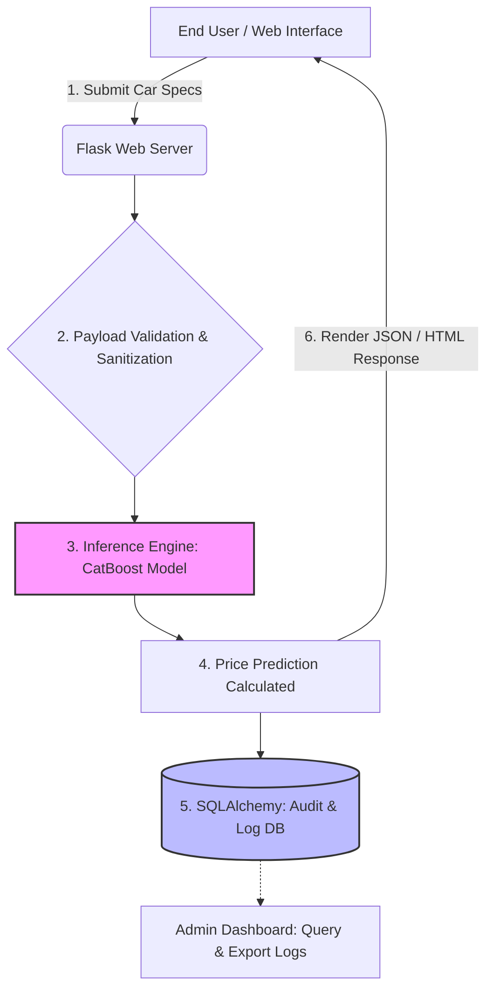

```markdown
# 🏎️ Audi-Predict: Production-Grade ML Deployment & Analytics Platform


> **An end-to-end Machine Learning deployment repository serving a pre-trained CatBoost regression model through a Flask REST API, featuring complete request observability, real-time inference, and a dedicated admin analytics dashboard.**

---

## 📌 Executive Summary & The "Black Box" Concept

This repository represents the **Production & Inference** phase of a comprehensive 27-page academic research project on secondary market vehicle valuation. 

**Why no training scripts?**
In accordance with professional MLOps practices, the data engineering, exploratory data analysis (EDA), and heavy model training pipelines were executed in an isolated, secure environment. **This repository is strictly dedicated to Model Deployment, API Integration, and System Observability.** 

It houses the compiled, highly-optimized CatBoost model (`model.cbm`) and the full-stack web infrastructure required to serve predictions to end-users in real-time.

---

## 🚀 Core Features

*   **Real-Time Inference Engine:** Delivers millisecond-latency price estimations based on complex, high-cardinality vehicle features (e.g., specific Audi chassis codes, damage history, mileage-to-age ratio).
*   **Native Categorical Handling:** Utilizes CatBoost's `.cbm` format to process categorical features directly without the memory overhead of one-hot encoding.
*   **Complete Observability:** Every user interaction, input payload, and predicted output is systematically logged into a relational database.
*   **Admin Analytics Dashboard:** A secure internal interface that allows administrators to monitor prediction requests, filter historical data, and analyze model behavior in the wild.
*   **RESTful API Architecture:** Decoupled backend (Flask) and frontend (HTML/JS) allowing for seamless scalability.

---

## ⚙️ System Architecture & Data Flow

The following diagram illustrates the complete lifecycle of a prediction request within the application:



### Step-by-Step Execution:

1. **Client Interaction:** The user inputs specific Audi details (Age, Mileage, Transmission, Fuel Type, Body Type, Damage status) via the web UI.
2. **API Routing:** `app.py` captures the POST request and maps the incoming form data to the model's required feature vector.
3. **Inference:** The compiled `model.cbm` file is loaded into memory. It processes the raw feature vector and returns a continuous numerical value (The Estimated Price).
4. **Database Transaction:** Before the user sees the result, SQLAlchemy opens a session, writes the exact input parameters and the predicted price to the `prediction_logs` table, and commits the transaction.
5. **Response:** The frontend dynamically updates to display the market value to the user.

---

## 🔌 API Reference (Internal)

The Flask backend exposes an internal endpoint for the frontend to consume.

**Endpoint:** `POST /predict`

**Sample Payload:**

```json
{
  "model_variant": "A4",
  "year": 2020,
  "mileage": 45000,
  "fuel_type": "Diesel",
  "transmission": "Automatic",
  "damage_history": "None",
  "engine_power": 190
}

```

**Sample Response:**

```json
{
  "status": "success",
  "predicted_price_try": 2150000,
  "log_id": "req-8923-xyz"
}

```

---

## 📂 Repository Structure

```text
.
├── app.py              # The core Flask application, API routes, and SQLAlchemy models.
├── model.cbm           # The pre-trained, production-ready CatBoost regression model.
├── requirements.txt    # Python dependencies for environment replication.
├── runtime.txt         # Defines the Python runtime version for cloud PaaS deployments.
├── templates/          # Frontend structure
│   ├── index.html      # Main prediction interface
│   └── admin.html      # Internal dashboard for monitoring database logs
└── static/             # CSS and JS assets

```

---

## 🛠️ Local Installation & Setup

To deploy this application in a local development environment:

**1. Clone the repository:**

```bash
git clone [https://github.com/ferhattkoc-ml/audi-price-prediction-app.git](https://github.com/ferhattkoc-ml/audi-price-prediction-app.git)
cd audi-price-prediction-app

```

**2. Create and activate a virtual environment (Recommended):**

```bash
python -m venv venv
source venv/bin/activate  # On Windows use: venv\Scripts\activate

```

**3. Install the required dependencies:**

```bash
pip install -r requirements.txt

```

**4. Initialize the server:**

```bash
python app.py

```

*The application will generate the local SQLite database automatically and bind to `http://127.0.0.1:5000/`.*

---
