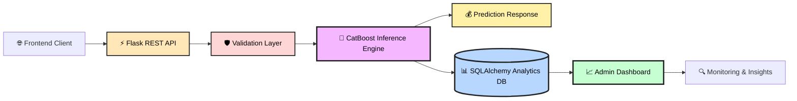

```markdown
# ## 🏎️ AudiPredict AI — Enterprise Vehicle Valuation Platform

<p align="center">
  
  
  
  
  
  
</p>

<h3 align="center">
AI-Powered Vehicle Price Intelligence & Real-Time ML Inference System
</h3>

<p align="center">
Production-grade Machine Learning deployment infrastructure serving a high-performance CatBoost regression model through a scalable Flask REST API with integrated analytics, observability, and enterprise monitoring.
</p>

---

## ✨ Overview

AudiPredict AI is a full-stack machine learning deployment platform developed for real-time secondary market vehicle valuation. The project focuses on the **productionization phase** of Machine Learning systems, transforming a research-grade predictive model into a scalable inference infrastructure capable of handling real-world prediction traffic with full auditability and analytics visibility.

---

## 🏗️ Production Architecture



---

## 🚀 Key Capabilities

* **⚡ Real-Time Inference:** Millisecond-level prediction latency using optimized `.cbm` deployment.
* **🧩 Native Categorical Intelligence:** Leverages CatBoost’s native processing to eliminate One-Hot Encoding overhead and sparse matrix inefficiencies.
* **📊 Enterprise Observability:** Full logging of input payloads, prediction outputs, and inference telemetry for drift analysis and auditability.
* **🔐 Admin Dashboard:** Dedicated panel for historical tracking, real-time request monitoring, and operational visibility.

---

## 🔄 Prediction Lifecycle

1. **Client Request:** User submits vehicle specifications (Model, Year, Mileage, etc.) via the UI.
2. **Validation Layer:** Payloads are sanitized and structured into feature vectors.
3. **ML Inference Engine:** The optimized `model.cbm` performs real-time regression.
4. **Database Logging:** SQLAlchemy persists the transaction for long-term analytics.
5. **Response:** The system returns estimated market value and inference metadata.

---

## 📂 Repository Structure

```text
.
├── app.py              # Flask core, API routes & SQLAlchemy models
├── model.cbm           # Optimized CatBoost production model binary
├── requirements.txt    # Production dependency definitions
├── runtime.txt         # Environment & Deployment configuration
├── templates/          # Frontend HTML templates & Admin UI
├── static/             # CSS, JavaScript & Brand assets
├── database/           # Prediction logs & analytical storage
└── logs/               # Structured system & inference logs

```

---

## 🛠️ Local Installation

### 1. Clone Repository

```bash
git clone [https://github.com/ferhattkoc-ml/arac_fiyat_tahmin.git](https://github.com/ferhattkoc-ml/arac_fiyat_tahmin.git)
cd arac_fiyat_tahmin

```

### 2. Environment Setup

```bash
python -m venv venv
# Linux/macOS: source venv/bin/activate
# Windows: venv\Scripts\activate

```

### 3. Installation & Execution

```bash
pip install -r requirements.txt
python app.py

```

*Application runs at: `http://127.0.0.1:5000*`

---

## 📡 API Reference

**Endpoint:** `POST /predict`

**Request Body:**

```json
{
  "model_variant": "Audi A6",
  "year": 2021,
  "mileage": 38000,
  "fuel_type": "Diesel",
  "transmission": "Automatic",
  "damage_history": "Minor",
  "engine_power": 204
}

```

**Response Example:**

```json
{
  "status": "success",
  "predicted_price": 2450000,
  "currency": "TRY",
  "model_version": "v1.0-production"
}

```

---

## 📈 MLOps Philosophy

This repository intentionally excludes training notebooks and raw datasets. The focus is strictly on **Deployment Engineering** and **Production Observability**. This mirrors enterprise standards where training environments are isolated, and inference systems operate as standalone, hardened production services.

---
